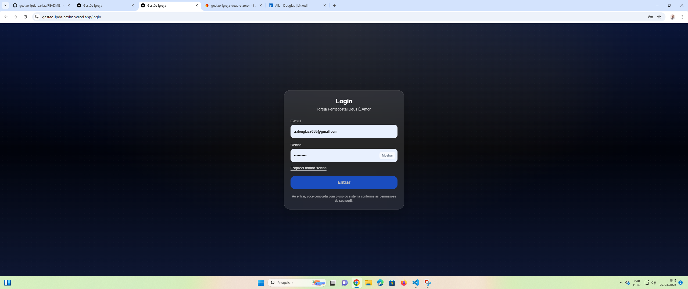
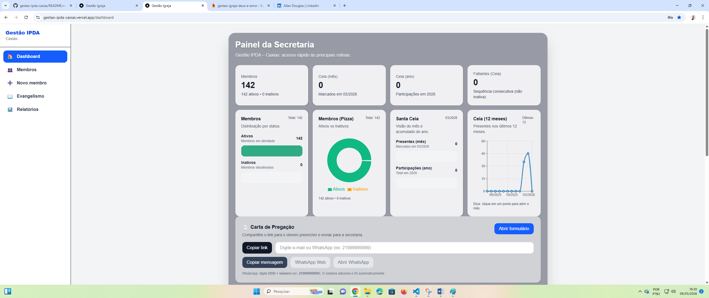
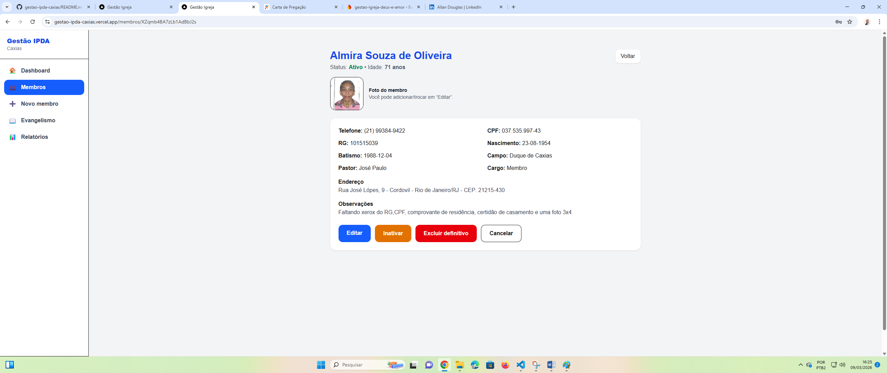
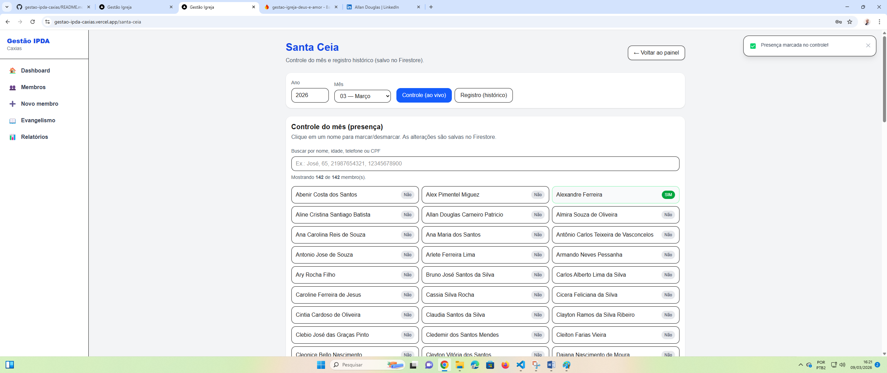

# Gestão IPDA – Caxias

Sistema SaaS para gestão administrativa de igrejas desenvolvido com **Next.js, Firebase e TypeScript**.

🚀 **Demo do sistema:**  
https://gestao-ipda-caxias.vercel.app
## 🔐 Conta de demonstração

Você pode acessar o sistema usando:

Email: demo@gestao-ipda.com
Senha: GestaoDemo2026

Este projeto foi desenvolvido como parte do meu **portfólio enquanto estudo Análise e Desenvolvimento de Sistemas**.

## 📸 Screenshots do Sistema

### 🔐 Tela de Login

### 📊 Dashboard

### 👥 Gestão de Membros

### 🍞 Controle de Santa Ceia

### 📋 Formulário Externo

---

# 🚀 Funcionalidades

## 👤 Gestão de Membros
- Cadastro completo de membros
- Edição e atualização de dados
- Inativação e reativação de membros
- Upload de foto
- Cálculo automático de idade
- Busca inteligente por nome, CPF ou idade

## 🍞 Controle da Santa Ceia
- Marcação de presença no mês
- Registro histórico anual
- Estatísticas mensais e anuais
- Identificação de faltantes recorrentes

## 📊 Dashboard Administrativo
- Estatísticas de membros
- Estatísticas da Santa Ceia
- Gráficos interativos
- Atividade recente do sistema

## 📝 Sistema de Auditoria
O sistema registra automaticamente ações administrativas como:

- Marcar presença na Santa Ceia
- Desmarcar presença
- Criar membro
- Editar membro
- Inativar membro

Essas ações são exibidas no dashboard como **atividade recente**, permitindo rastreabilidade das operações.

## 📄 Exportação de Relatórios
- Exportação para Excel (XLSX)
- Relatório do dia da Ceia
- Registro anual de participantes

---

# 🧱 Tecnologias Utilizadas

### Frontend
- Next.js
- React
- TypeScript

### Estilização
- TailwindCSS

### Backend / Banco de dados
- Firebase Firestore

### Autenticação
- Firebase Auth

### Armazenamento de imagens
- Cloudinary

### Gráficos
- Recharts

### Hospedagem
- Vercel

### Controle de versão
- Git + GitHub

---

# 🔐 Sistema de Permissões

O sistema possui controle de acesso baseado em roles:

- **admin** → acesso total
- **secretaria** → gestão administrativa
- **lider** → controle da Santa Ceia
- **consulta** → acesso apenas para leitura

As permissões são implementadas utilizando **Firebase Custom Claims**.

---

# 📊 Dashboard

O painel principal apresenta:

- Estatísticas de membros
- Estatísticas da Santa Ceia
- Gráficos interativos
- Lista de atividades recentes
- Acesso rápido às principais rotinas

---

# 🌐 Deploy

O sistema está hospedado na **Vercel**.

🔗 Acesse o sistema:  
https://gestao-ipda-caxias.vercel.app

---

# 🎯 Objetivo do Projeto

Este sistema foi desenvolvido como projeto de portfólio para demonstrar habilidades em:

- desenvolvimento fullstack
- arquitetura de aplicações web
- integração com Firebase
- design de sistemas administrativos
- implementação de dashboards e relatórios

---

# 👨‍💻 Autor

**Allan Carneiro**

Estudante de **Análise e Desenvolvimento de Sistemas**  
Desenvolvedor em formação

---

# 📌 Status do Projeto

🚧 Em evolução contínua.

Próximas melhorias planejadas:

- timeline visual de atividades
- melhorias no sistema de auditoria
- novos relatórios administrativos
